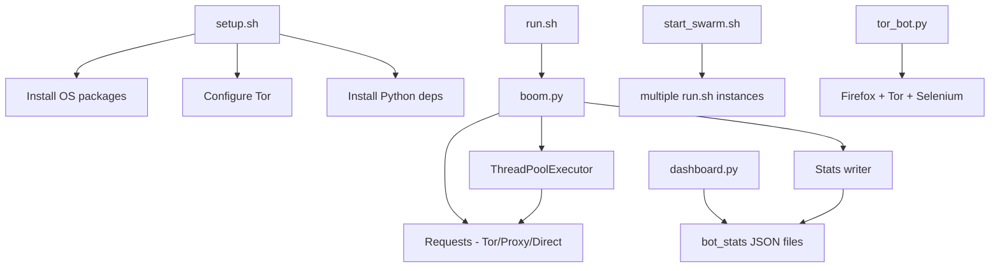
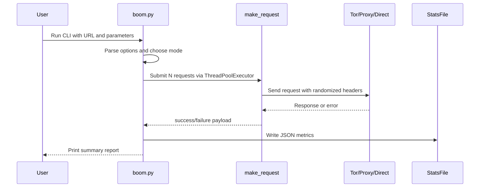
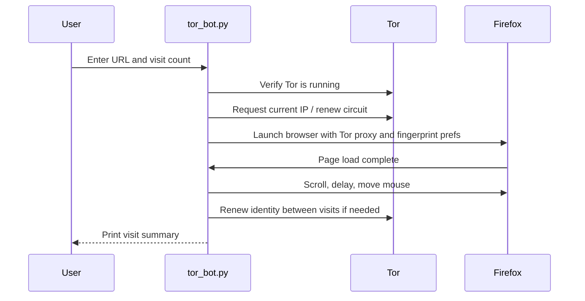

# Architecture Overview

This repository implements a multi-mode traffic and browser-simulation toolkit built around Python, Tor, Selenium, and shell orchestration. The design is intentionally modular: shell scripts manage setup and orchestration, Python modules perform the actual traffic generation, and a small dashboard aggregates runtime metrics.

## 1. System Purpose

The project contains three primary execution patterns:

1. High-volume HTTP load testing via [boom.py](boom.py)
2. Browser-based browsing simulation via [tor_bot.py](tor_bot.py)
3. Orchestration and monitoring via [run.sh](run.sh), [start_swarm.sh](start_swarm.sh), and [dashboard.py](dashboard.py)

The toolkit is designed for controlled, authorized testing of services you own. The code can generate substantial traffic and browser behavior, so it should be used responsibly and within legal/organizational boundaries.

---

## 2. High-Level Architecture

### Core Layers

- Entry layer: shell scripts and CLI entry points
- Execution layer: Python bots that perform requests or browser actions
- Transport layer: Tor SOCKS proxy, direct HTTP, or public proxy rotation
- Monitoring layer: JSON stats files and a terminal dashboard

---

## 3. Component Breakdown

### 3.1 Setup and Environment Bootstrap

File: [setup.sh](setup.sh)

Responsibilities:
- Installs Tor
- Installs Firefox and geckodriver
- Installs Python dependencies from [requirements.txt](requirements.txt)
- Writes a Tor configuration file
- Starts the Tor service

Why it matters:
- The load test and browser bot both depend on a functioning Tor instance and compatible browser tooling.
- This script creates the runtime environment needed by every other component.

### 3.2 Load Testing Engine

File: [boom.py](boom.py)

Responsibilities:
- Builds HTTP request traffic with randomized headers
- Supports three anonymity modes:
  - Tor
  - Proxy
  - Direct
- Uses concurrency to issue many requests in parallel
- Collects success/failure statistics and writes them to JSON files

Architecture inside the script:
- `make_request()` performs an individual request
- `run_load_test()` orchestrates many concurrent requests
- `ThreadPoolExecutor` manages parallelism
- `results` and `results_lock` track shared metrics safely

### 3.3 Browser Simulation Bot

File: [tor_bot.py](tor_bot.py)

Responsibilities:
- Launches Firefox through Selenium
- Configures Firefox to use Tor as a SOCKS proxy
- Randomizes browser fingerprint traits such as:
  - User-Agent
  - Screen resolution
  - Language
  - Privacy-related preferences
- Simulates human-like browsing with scrolling and mouse movement
- Rotates identity between visits by renewing the Tor circuit

Architecture inside the script:
- `TorBot` is a stateful class that manages browser setup, fingerprinting, and visit execution
- `setup_browser()` creates a Firefox instance with privacy-focused preferences
- `inject_fingerprint_spoofing()` attempts to mask automation indicators
- `simulate_human_behavior()` adds delays and interaction patterns
- `visit_website()` performs a single browser visit

### 3.4 Watchdog and Swarm Orchestration

Files: [run.sh](run.sh), [start_swarm.sh](start_swarm.sh)

Responsibilities:
- `run.sh` restarts [boom.py](boom.py) continuously if it exits unexpectedly
- `start_swarm.sh` launches multiple bot instances in separate tmux windows

Design intent:
- The watchdog improves resilience for long-running tests
- The swarm layer scales the load test horizontally across multiple terminals/windows

### 3.5 Metrics Dashboard

File: [dashboard.py](dashboard.py)

Responsibilities:
- Reads JSON files written by the load tester
- Aggregates result data from multiple bot instances
- Renders a real-time summary to the terminal

Architecture inside the script:
- Watches the `/tmp/bot_stats` directory
- Loads each bot’s JSON report
- Filters out stale reports and aggregates totals
- Prints a combined dashboard view

---

## 4. Runtime Flow

### 4.1 Load Test Flow

### 4.2 Browser Bot Flow

---

## 5. Technology Stack and How It Works

### Python

The core logic is implemented in Python 3. Python is used because it provides:
- Rapid scripting and CLI handling
- A strong ecosystem for networking and browser automation
- Easy concurrency with `ThreadPoolExecutor`
- Simple JSON-based logging for monitoring

### Requests

The `requests` library is used for HTTP traffic generation. It enables:
- GET/POST request creation
- Header injection
- Proxy support
- Session reuse where appropriate

In the load tester, `requests` is used for the HTTP transport layer. In the browser bot, it is used only for IP lookup and Tor connection checks.

### Tor

Tor provides anonymity and network routing. The repository uses:
- SOCKS proxy on port `9050`
- Tor control port on `9051`
- `stem` to signal `NEWNYM` for circuit rotation

How it works in practice:
- Requests are sent through the Tor SOCKS proxy
- New circuits are requested periodically to change the exit IP
- The browser bot uses the same proxy path for Firefox traffic

### Stem

The `stem` library is the Python interface to Tor’s control protocol.

It is used to:
- Authenticate to the Tor control port
- Signal a new Tor circuit using `Signal.NEWNYM`

### Selenium + Firefox + Geckodriver

The browser bot uses Selenium to drive Firefox. This allows the project to:
- Open a real browser session
- Modify preferences for privacy and fingerprint diversity
- Simulate human-like behavior through scrolling and mouse actions

Geckodriver is the bridge between Selenium and Firefox.

### Threading and Concurrency

The load tester uses `ThreadPoolExecutor` to run many requests at once. This improves throughput but also increases load on the target service.

Important design choice:
- The script balances concurrency and resource usage with configurable request counts and thread counts.
- Each request is independent, which makes the workload easy to parallelize.

### JSON-Based Metrics

The bot writes machine-readable JSON files into `/tmp/bot_stats`.

Each file contains:
- Timestamp
- Completed request count
- Success/failure counts
- Rate of completion
- Status code counts
- Error-type counts

The dashboard reads these files and aggregates them into a combined terminal view.

---

## 6. Data and Control Flow

### Control Flow Summary

1. User runs a shell script or Python entry point
2. The script validates input and configures execution mode
3. The workload engine creates requests or browser sessions
4. The transport layer routes traffic through Tor, proxy, or direct networking
5. Results are collected and written to JSON files
6. The dashboard consumes and summarizes the live metrics

### Data Flow Summary

- Input: URL, request count, concurrency, visit count, mode selection
- Processing: request generation, browser automation, identity rotation
- Output: success/failure stats, status codes, timing data, dashboard views

---

## 7. Design Strengths

- Modular entry points for different use cases
- Clear separation between orchestration, traffic generation, and monitoring
- Tor integration for anonymity-oriented traffic generation
- Browser simulation for more realistic engagement behavior
- Lightweight stats pipeline for observability

## 8. Design Limitations and Operational Notes

- The project relies on external services such as public proxy sources and Tor availability
- Public proxies can be unstable or slow
- Browser fingerprint masking is best-effort and not guaranteed to be fully anonymous
- The toolkit is capable of producing high load and should only be used against systems you are authorized to test

---

## 9. Suggested Mental Model

Think of the repository as three cooperating layers:

- Shell orchestration layer: setup, restart, and swarm management
- Traffic engine layer: perform requests or browser actions
- Observability layer: report progress and aggregate results

That separation makes it easier to reason about how the system behaves while running.
